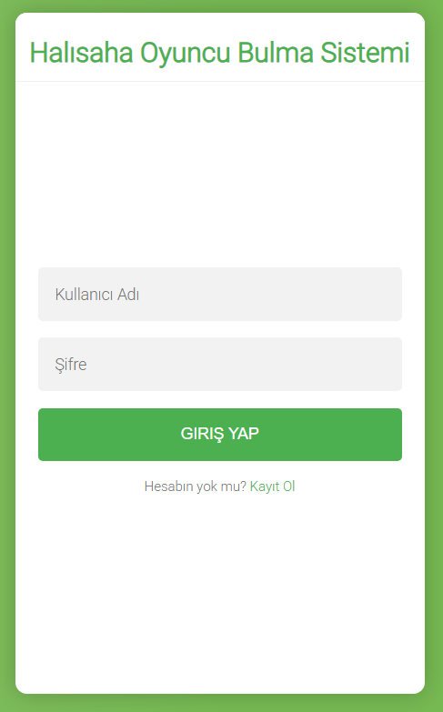
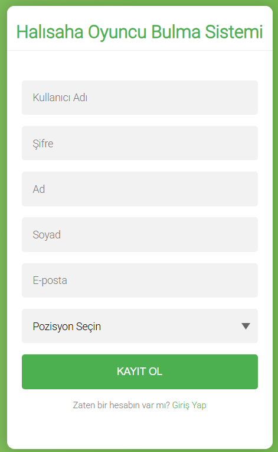
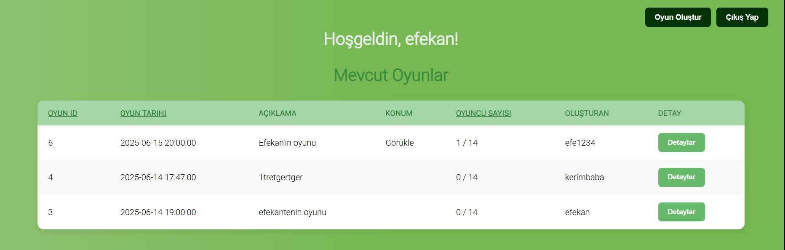
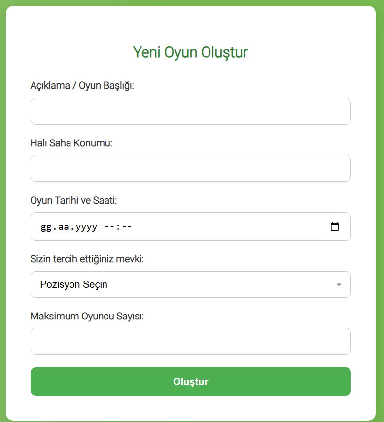

# Halı Saha Oyuncu Bulma Sistemi

Bu Proje Bursa Teknik Üniversitesi Bilgisayar Mühendisliği'nde Web Tabanlı Programlama dersi kapsamında verilen proje ödevi için geliştirilmiştir. Proje halı saha oynamak isteyip oyuncu bulmakta zorlanan insanları bir araya getirip bu sorunu ortadan kaldırmayı hedeflemektedir. Proje için PHP, CSS, JS, HTML kullanılmıştır.

Proje yapısı : 

halisaha/
│
├── connection.php          # Veritabanı bağlantısı

├── db_operations.php       # CRUD işlemleri

├── index.php               # Anasayfa (mevcut oyunlar listesi)

├── create_game.php         # Yeni oyun oluşturma formu

├── game_details.php        # Oyun detayları ve katılma/pozisyon seçimi

├── post_operations.php     # Form işlemlerinin işlendiği yer

├── login.php / logout.php  # Giriş / çıkış işlemleri

## Site işlevleri : 

- Kullanıcı girişi ve oturum yönetimi

- Oyun (maç) oluşturma

- Mevcut oyunlara katılma

- Oyun detaylarını görüntüleme

- Oyuncu pozisyonu seçme ve değiştirme

- Oyun listesini tarihe, ID’ye veya oyuncu sayısına göre sıralama

- Oyunlardan çıkma

- Basit kullanıcı arayüzü

**Kullanıcı giriş çıkış sisteminde şifreler password_hash() ile şifrelenir.**

## Ekran Görüntüleri 

[Projenin video tanıtım linki](https://youtu.be/-9m49OTqxkY)